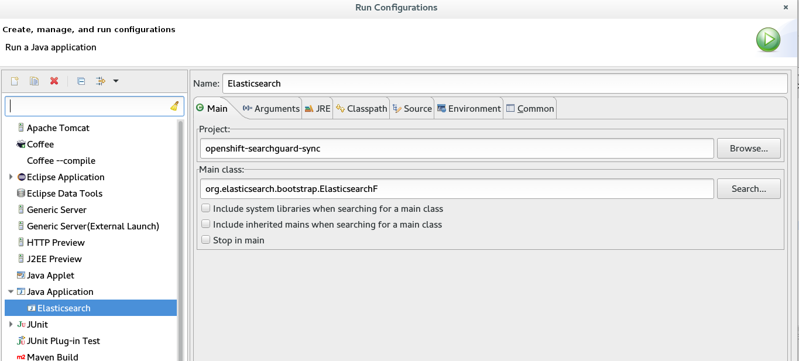

# OpenShift ElasticSearch plugin
This is an OpenShift plugin to ElasticSearch to:

* Dynamically update the SearchGuard ACL based on a user's name
* Transform kibana index requests to support multitenant deployments
* Seed the Searchguard index `config`, `roles`, `rolesmapping`, and `actiongroups` types

## Configuring your initial ACLs
With the update to use Searchguard-2 and Searchguard-SSL for ES 2.3.x, the
OpenShift-Elasticsearch-Plugin now populates the initial ACL and configuration in
a manner similar to how the sgadmin tool from [Searchguard](https://github.com/floragunncom/search-guard#dynamic-configuration)
describes.  Configurations are read in from `searchguard.config.path` (Default: `/opt/app-root/src/sgconfig/`).
The files should match the name patterns ["sg_config.yml", "sg_roles.yml",
"sg_rolesmapping.yml", "sg_actiongroups.yml"].  The plugin does not use internal_users
as Searchguard does. Roles are used to define actions that are allowed for
particular indices and types. RolesMapping map user names to specific roles.

You can view sample configurations [here] (./samples/).

As with `sgadmin`, the plugin needs to use the certificate with a DN that matches
the `searchguard.authcz.admin_dn` as defined in the ES config to be able to
update the Searchguard index. You can specify the certificate and truststore information
for the esClient with the following properties.

|Property|Description|
|-------|--------|
|*_openshift.searchguard.keystore.path_*|The certificate that contains the cert and key for the admin_dn. Default: *_/usr/share/elasticsearch/config/admin.jks_*|
|*_openshift.searchguard.truststore.path_*|The truststore that contains the certificate for Elasticsearch. Default: *_/usr/share/elasticsearch/config/logging-es.truststore.jks_*|
|*_openshift.searchguard.keystore.password_*|The password to open the keystore. Default: *_kspass_*|
|*_openshift.searchguard.truststore.password_*|The password to open the truststore. Default: *_tspass_*|
|*_openshift.searchguard.keystore.type_*|The file type for the keystore. JKS or PKCS12 are accepted. Default: *_JKS_*|
|*_openshift.searchguard.truststore.type_*|The file type for the truststore. JKS or PKCS12 are accepted. Default: *_JKS_*|

## Configure the projects for '.operations'
You can configure which projects are deemed part of the .operations index for ACL
configuration.

In your config file:
```
openshift.operations.project.names: ["default", "openshift", "openshift-infra"]
```

The defaults are "default", "openshift", "openshift-infra", "kube-system".
The names must all be in lower-case to be properly matched.

## Configure a 'cluster-reader' user to access operation logs
To allow users that are cluster-reader or cluster-admin to be able to see the
operations logs within Kibana, add the following line to your Elasticsearch config
file:
```
openshift.operations.allow_cluster_reader: true
```

## Additional Configuration Parameters
The following additional parameters can be set in set in `elasticsearch.yml`:

|Property|Description|
|-------|--------|
|*io.fabric8.elasticsearch.acl.sync_delay_millis*|The delay in milliseconds before the SG AGL document is resynced with OpenShift|
|*io.fabric8.elasticsearch.acl.user_profile_prefix*| The prefix to use to store Kibana user visualizations (default: `.kibana.USERUUID`)|
|*io.fabric8.elasticsearch.kibana.mapping.app*| Absolute file path to a JSON document that defines the index mapping for applications| 
|*io.fabric8.elasticsearch.kibana.mapping.ops*| Absolute file path to a JSON document that defines the index mapping for operations|
|*io.fabric8.elasticsearch.kibana.mapping.empty| Absolute file path to a JSON document that defines the index mapping for blank indexes|
|*openshift.config.project_index_prefix*| The string value that project/namespace indices use as their prefix (default: ``) for example, with the
  common data model, if the namespace is `test`, the index name will be
  `project.test.$uuid.YYYY.MM.DD`.  In this case, use `"project"` as the
  prefix - do not include the trailing `.`.|

## Development
Following are the dependencies

* [ElasticSearch 2.4.1] (https://github.com/elastic/elasticsearch/tree/2.4)
* [Search-Guard 2.4.1.10] (https://github.com/floragunncom/search-guard/tree/2.4.1.10)
* [Search-Guard-SSL 2.4.1.19] (https://github.com/floragunncom/search-guard-ssl/tree/2.4.1.19)

### Debugging and running from Eclipse

* Install ES

* Create a run configuration
 * Main Class
 

 * VM args:

 ````-Des.path.home=${env_var:ES_HOME} -Delasticsearch -Des.foreground=yes -Dfile.encoding=UTF-8 -Delasticsearch -Xms256m -Xmx1g -Djava.awt.headless=true -XX:+UseParNewGC -XX:+UseConcMarkSweepGC -XX:CMSInitiatingOccupancyFraction=75 -XX:+UseCMSInitiatingOccupancyOnly -XX:+HeapDumpOnOutOfMemoryError -XX:+DisableExplicitGC````


 * Environment Variables:

   
