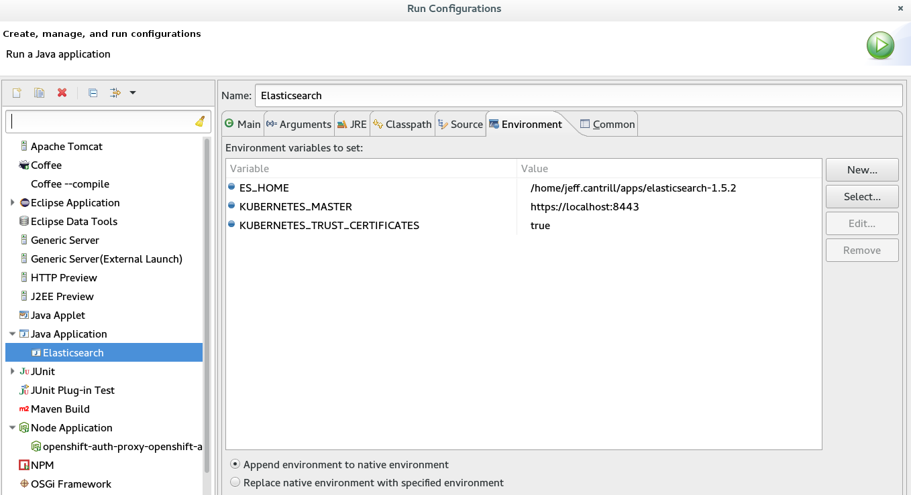

# OpenShift ElasticSearch plugin
This is an OpenShift plugin to ElasticSearch to:

* Dynamically update the SearchGuard ACL based on a user's name
* Correctly return Unauthorized or Forbidden response codes
* Transform kibana index requests to support multitenant deployments
* Support proxy auth with fallback to client certificate auth

## Configuring your initial ACLs
We now allow you to configure your initial ACL users, indices, comments, executions and
bypasses via your elasticsearch config file.

To maintain the same ACL definitions as the previous release of the OpenShift
Elasticsearch Plugin add the following to your config file:
```
openshift:
  acl:
    users:
      names: ["system.logging.fluentd", "system.logging.kibana", "system.logging.curator"]
      system.logging.fluentd:
        execute: ["actionrequestfilter.fluentd"]
        actionrequestfilter.fluentd.comment: "Fluentd can only write"
      system.logging.kibana:
        bypass: ["*"]
        execute: ["actionrequestfilter.kibana"]
        actionrequestfilter.kibana.comment: "Kibana can only read from every other index"
      system.logging.kibana.*.comment: "Kibana can do anything in the kibana index"
      system.logging.kibana.*.indices: [".kibana.*"]
      system.logging.curator:
        execute: ["actionrequestfilter.curator"]
        actionrequestfilter.curator.comment: "Curator can list all indices and delete them"
```

The structure follows the configuration structure for Search-guard.
At the upper level you define the users you will be using within your ACL:
`openshift.acl.users.names: []`.

Then for each user, you can define what they can execute or bypass.  For each
execute or bypass you can then further configure the indices they apply to
and the comments you would like for them.

E.g. for the following user, we will configure the ACL to execute
'actionrequestfilter.readonly' for the index 'myIndex' with a comment to describe
it:
```
openshift:
  acl:
    users:
      names: ["system.example.user"]
      system.example.user:
        execute: ["actionrequestfilter.readonly"]
        actionrequestfilter.readonly:
          indices: ["myIndex"]
          comment: "This restricts me to only be able to read from myIndex"
```

Note: if you use a "\*" for any of your bypass or execute statements, you will need
to structure its configuration as a full path, you cannot begin a line with "\*".

## Development
Following are the dependencies

* [ElasticSearch 1.5.2] (https://www.elastic.co/downloads/past-releases/elasticsearch-1-5-2)
* [Search-Guard 0.5] (https://github.com/floragunncom/search-guard/tree/v0.5)

### Debugging and running from Eclipse

* Install ES

* Create a run configuration
 * Main Class
 

 * VM args:

 ````-Des.path.home=${env_var:ES_HOME} -Delasticsearch -Des.foreground=yes -Dfile.encoding=UTF-8 -Delasticsearch -Xms256m -Xmx1g -Djava.awt.headless=true -XX:+UseParNewGC -XX:+UseConcMarkSweepGC -XX:CMSInitiatingOccupancyFraction=75 -XX:+UseCMSInitiatingOccupancyOnly -XX:+HeapDumpOnOutOfMemoryError -XX:+DisableExplicitGC````


 * Environment Variables:

   
